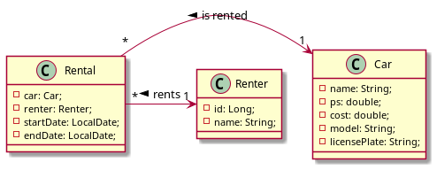
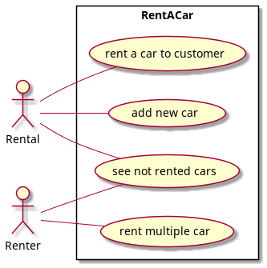

# Projekt RentACar
Author: Bozidar Spasenovic

### Beschreibung
Die Idee des RentACar Projektes ist ein RestService der ein Autoverleih mit den einzelnen Daten simuliert.
Es gibt eine Vermietung, einen Kunden und mehrere Fahrzeuge die zum vermieten bereit sind.

# Class-Diagram

# Use Case-Diagram

